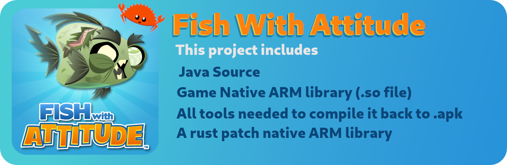

# A repository containing all the source and patch proxy library of fish-with-attititude game.

It might help others bring it back to life.

## How to compile it?

> [!NOTE]  
> First, install [Rust](https://www.rust-lang.org/) compiler and cargo ndk (`cargo install cargo-ndk`)

Use build script in current directory by using `./build.sh`
This will download all the dependencies and compile the project.

You will find the compiled binary in `/dist/outputs/FishWithAttititude.apk` directory.
And that's it!

You can edit java source code in `src-java` directory. And add more symbols to `native-rust-fish` proxy to invoke native Rust functions from Java or patch the game.
